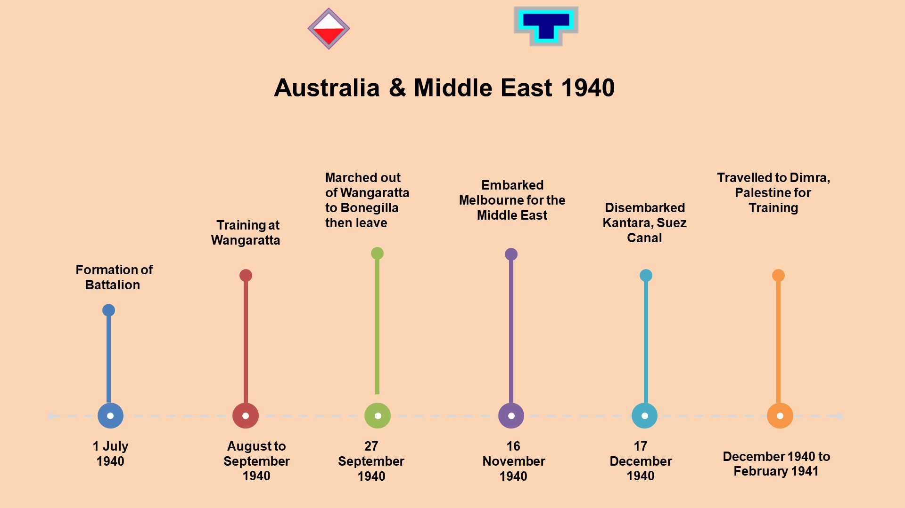
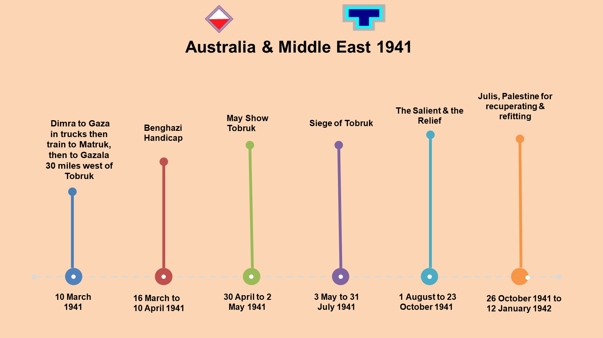
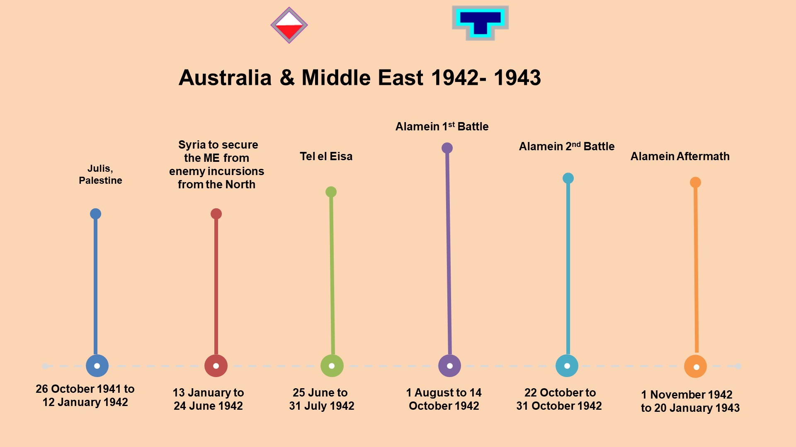
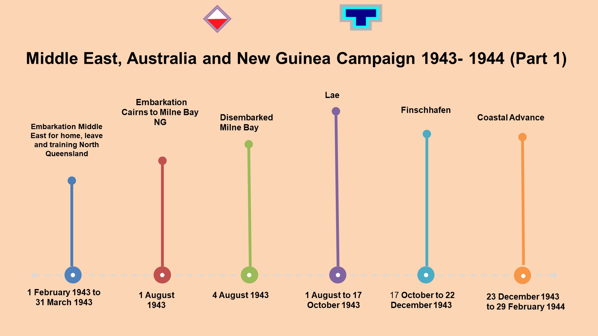
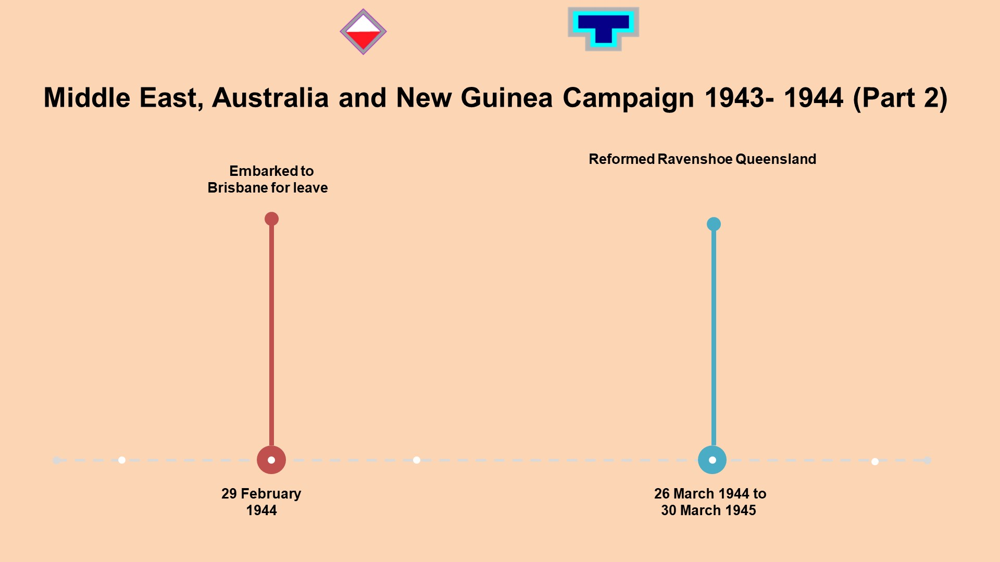
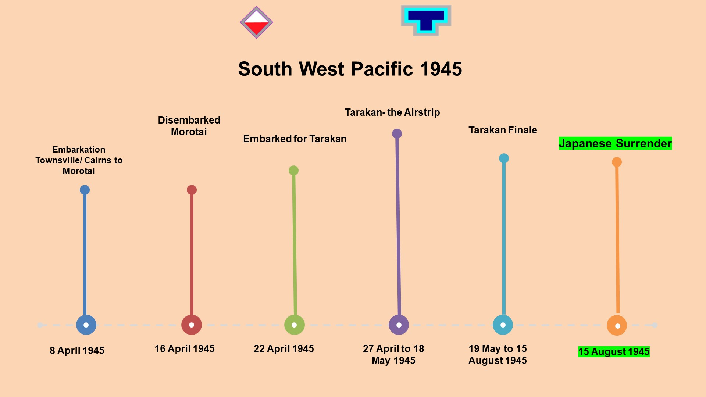
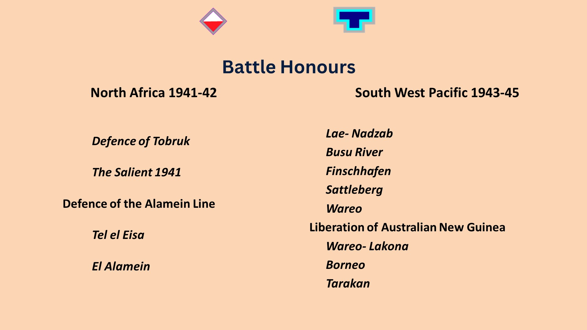
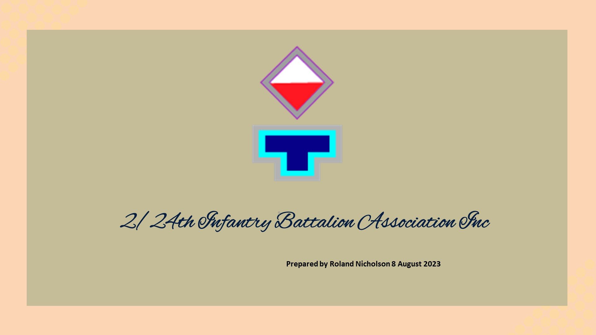

# The 2/24th battalion

Roland Nicholson prepared a presentation of the timeline and location of the 24th Battalion below.

You can download it as a [pptx/powerpoint file here](timeline.html)

<iframe src="https://www.google.com/maps/d/embed?mid=1yCYOlYnnxR8gxbJIwepvS2g39y7QS4o&ehbc=2E312F" width="640" height="480"></iframe>
